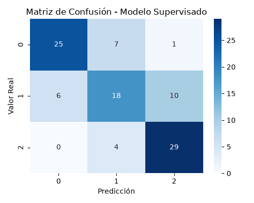
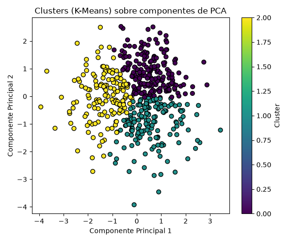

# Lab Evaluación — Pipeline de Inteligencia Artificial

Pipeline modular en Python que genera un dataset sintético, aplica
preprocesamiento, entrena un modelo de clasificación supervisada y
realiza un agrupamiento no supervisado con visualización en 2D.

## 1. Arquitectura del proyecto

```
lab-evaluacion/
├── data/
│   └── dataset.csv              # Dataset sintético generado
├── src/
│   ├── data_loader.py           # Generación y carga del dataset
│   ├── preprocessing.py         # Split train/test + StandardScaler
│   ├── supervised_model.py      # Clasificador (entrenamiento y evaluación)
│   └── unsupervised_model.py    # PCA + K-Means + Silhouette
├── outputs/
│   ├── confusion_matrix.png     # Matriz de confusión del modelo supervisado
│   └── clusters_pca.png         # Clusters visualizados en 2D
├── main.py                      # Orquestador principal del pipeline
├── .gitignore
└── README.md                    # Este archivo
```

**Flujo de ejecución (`main.py`):**

1. `data_loader.py` genera un dataset sintético con `make_classification`
   (500 muestras, 6 características continuas, 3 clases) y lo guarda en
   `data/dataset.csv`. Luego se vuelve a cargar desde ese CSV.
2. `preprocessing.py` separa los datos en 80% train / 20% test (con
   estratificación por clase) y ajusta el `StandardScaler`
   **únicamente** con los datos de entrenamiento, aplicando después la
   misma transformación a train y test.
3. `supervised_model.py` entrena una Regresión Logística sobre los
   datos escalados y reporta Accuracy, F1-score y Matriz de Confusión.
4. `unsupervised_model.py` aplica PCA (4→2 componentes) sobre el
   dataset completo escalado, agrupa con K-Means (k=3) y calcula el
   Silhouette Score y la varianza explicada acumulada.

## 2. Cómo ejecutar

```bash
pip install scikit-learn pandas matplotlib seaborn numpy
python main.py
```

Esto crea/actualiza `data/dataset.csv` y las imágenes en `outputs/`.

## 3. Métricas obtenidas

> Estos son los resultados de una ejecución de referencia (con
> `random_state=42`). Al correr `main.py` en tu equipo deberían salir
> valores iguales o muy similares.

### Pipeline Supervisado (Regresión Logística)

| Métrica   | Valor  |
|-----------|--------|
| Accuracy  | 0.7200 |
| F1-score  | 0.7143 |

**Matriz de Confusión:**



### Pipeline No Supervisado (PCA + K-Means, k=3)

| Métrica                          | Valor  |
|-----------------------------------|--------|
| Silhouette Score                  | 0.3609 |
| Varianza explicada acumulada (PCA)| 0.4125 |

**Clusters sobre las 2 componentes principales:**



- **Pregunta 1:** _(pendiente)_
- **Pregunta 2:** _(pendiente)_
- **Pregunta 3:** _(pendiente)_
